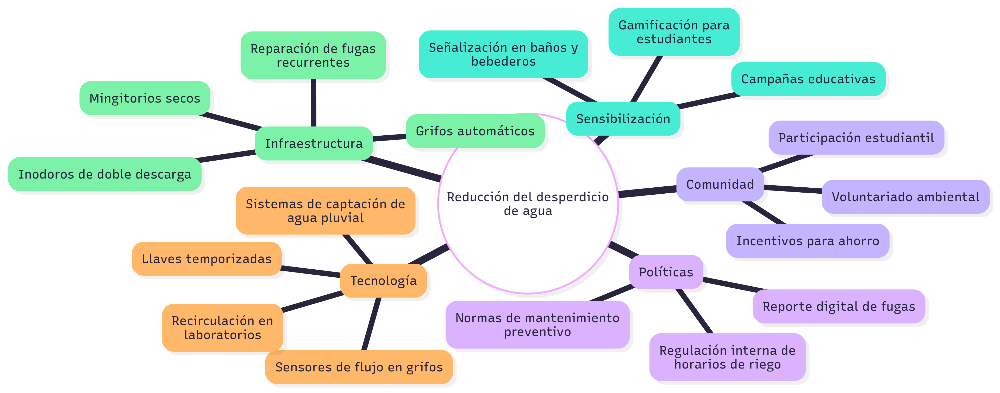

# **Actividad 1**: Caso de Design Thinking "Reduccion del desperdicio de agua en instalaciones universitarias"

## Mapa mental

---

## Metodología Design Thinking

**Fase 1: Empatizar**

- Entrevistas a estudiantes y personal de mantenimiento.

- Observación directa en baños, bebederos y áreas de riego.

- Identificación de puntos críticos: fugas, descuido, falta de cultura del ahorro.

**Fase 2: Definir**

**Problema principal:** “El agua se desperdicia en instalaciones universitarias debido a fugas, malos hábitos y ausencia de sistemas inteligentes de control.”

**Fase 3: Idear**

Soluciones propuestas:

- Instalación de grifos automáticos y temporizadores.
- Plataforma móvil para reportar fugas en tiempo real.
- Programa de recompensas para facultades con menor consumo.
- Reaprovechamiento de aguas grises para riego.

**Fase 4: Prototipar**

- Crear un piloto en un edificio: instalar 3 grifos con sensor, señalética de ahorro y sistema de registro de consumos.

- App simple (mockup en Figma o Miro) para reportar fugas.

**Fase 5: Testear**

- Recolectar datos de ahorro en litros/mes tras la intervención.

- Encuestas a usuarios sobre facilidad y aceptación.

- Ajustar el prototipo antes de escalar al resto del campus.