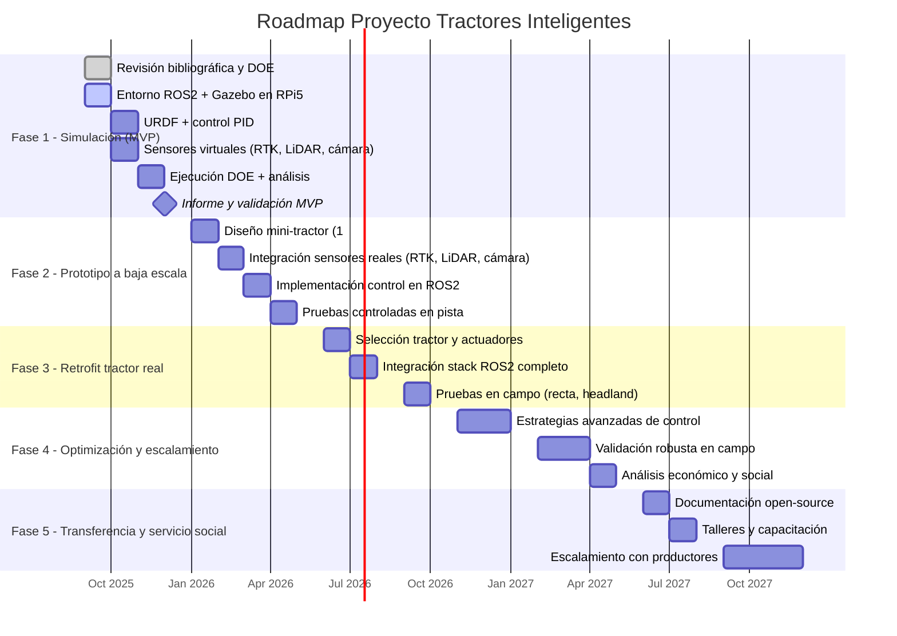

# Planeación General del Proyecto

## Fases del proyecto

### Fase 1 – Simulación y validación (MVP en ROS2 + Gazebo)

- Instalar entorno en RPi5 con ROS2 Humble y Gazebo.
- Crear modelo URDF/Xacro del tractor con pedales y volante.
- Integrar RTK sintético, LiDAR y cámara virtual.
- Implementar controladores básicos (PID) y adaptativos.
- Correr DOE piloto y completo (trayectorias recta, S, headland).
- Métricas: error guiado, tiempo, percepción, estabilidad.

### Fase 2 – Prototipo a baja escala

- Construcción de un mini-tractor a escala 1:10 o 1:8 con actuadores para pedales y dirección.
- Integración de GNSS RTK real (por ejemplo, módulo u-blox F9P).
- Uso de LiDAR de bajo costo (RPLidar A1/A2) y cámara RGB.
- Implementación de control en ROS2 sobre RPi5 u otra SBC.
- Validación experimental en pista controlada.

### Fase 3 – Retrofit en tractor convencional

- Selección de un tractor de uso común en Puebla.
- Diseño de kits de actuadores para volante y pedales (modulares, reversibles).
- Integración del stack ROS2 con sensores reales (RTK, LiDAR, cámara).
- Pruebas en campo con trayectorias sencillas (recta, headland).
- Comparación frente a operación manual.

### Fase 4 – Optimización y escalamiento

- Optimizar estrategias de control (LQR, difuso, híbridos).
- Validar robustez en condiciones reales: polvo, vibración, oclusiones.
- Análisis económico: costo del retrofit vs. tractor inteligente nuevo.
- Plan de adopción con pequeños productores → impacto social.

### Fase 5 – Transferencia y servicio social

- Documentación y manual de implementación open source.
- Talleres de capacitación a agricultores y estudiantes.
- Escalamiento a diferentes cultivos y terrenos.
- Conexión con programas de apoyo gubernamental o cooperativas rurales.

## Roadmap General

