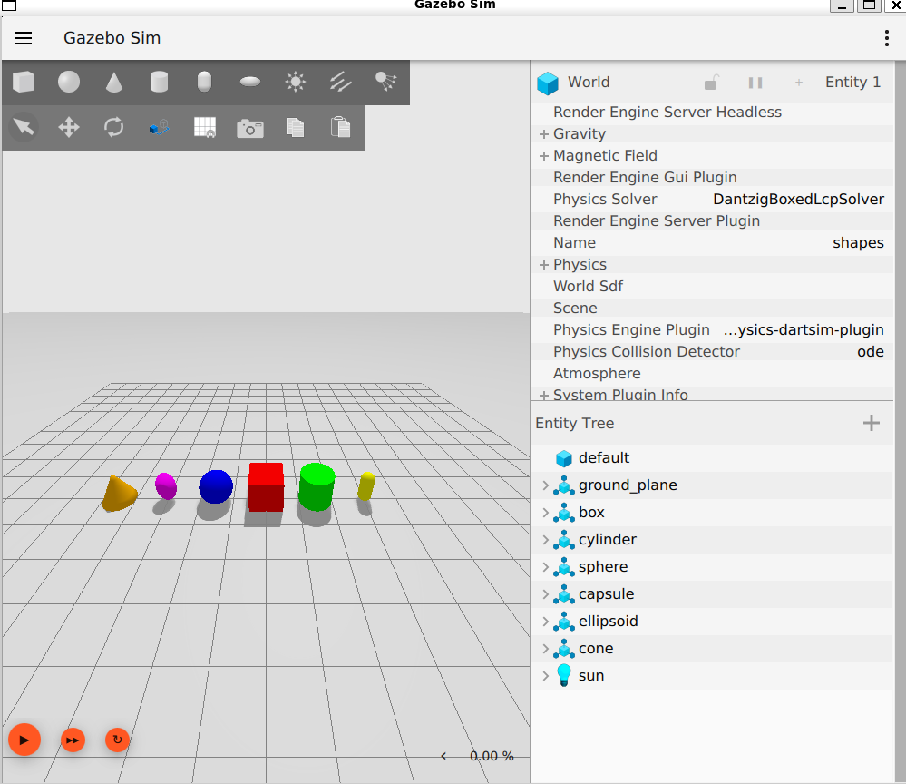
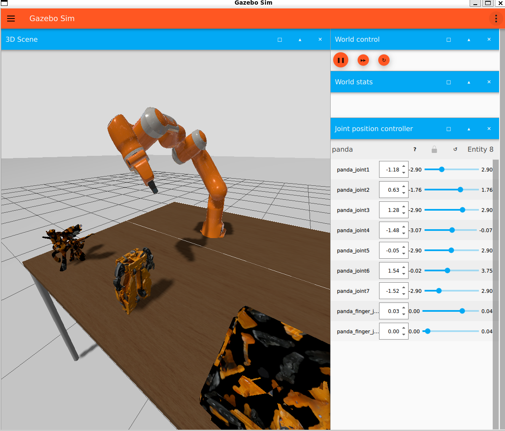
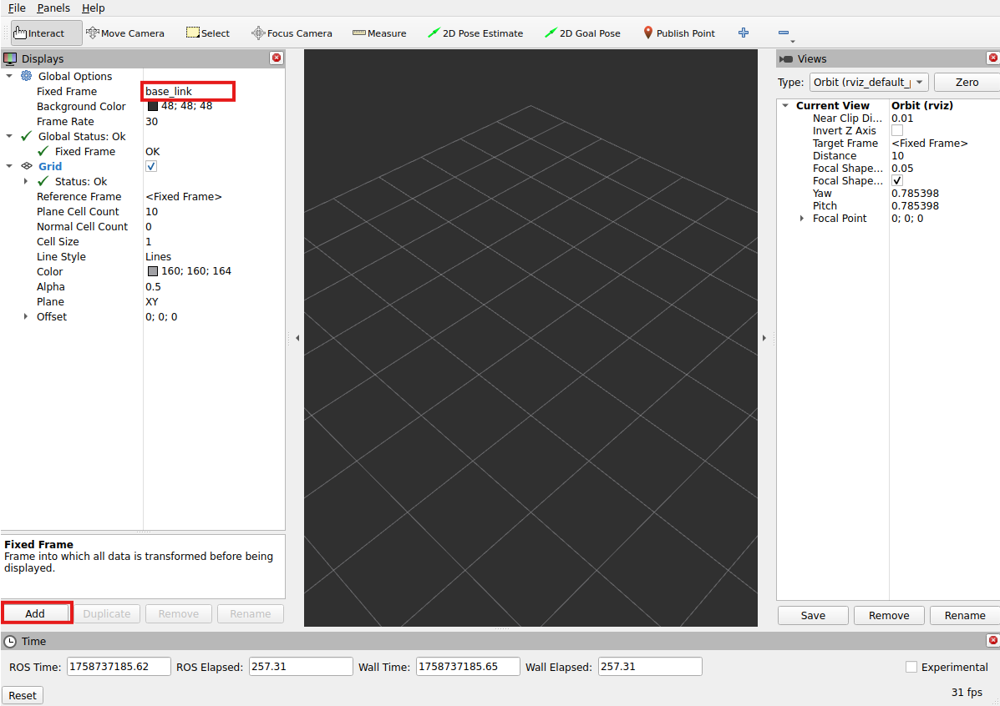
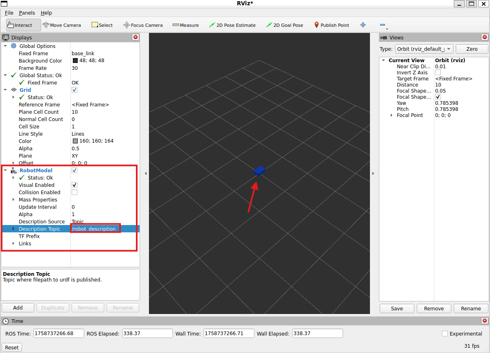

# ROS 2 Jazzy Mobile Robot on WSL2 with Gazebo Harmonic

## 1. Install ROS

### 1.1 Instalar WSL2 y Ubuntu 24.04

- **Si ya estás en Ubuntu nativo:** Omite este paso completo (instalación de WSL2 y Ubuntu).
- **Si estás en Windows 11:** Sigue todos los pasos.

WSL2 (Windows Subsystem for Linux 2) es una mejora del Subsistema de Windows para Linux (WSL), que permite ejecutar distribuciones Linux nativas en Windows sin necesidad de máquinas virtuales tradicionales.

Abre **PowerShell** como administrador:

```bash
wsl --install -d Ubuntu-24.04
```

Este comando:
- Habilita el Subsistema de Windows para Linux (WSL) y la plataforma de máquina virtual.
- Configura WSL2 como la versión por defecto.
- Descarga e instala Ubuntu 24.04 LTS (Noble Numbat).

### 1.2 Primer arranque y actualización del sistema

Si estas en windows inicia Ubuntu (Desdes inicio) y crea un usuario/contrasena de UNIX(La contrasena no mostrara caracteres cuando escribes), posteriormente en el shell corre los siguientes comandos:

```bash
sudo apt update
sudo apt full-upgrade -y
```

Esto actualizará tu Ubuntu.

### 1.3 Configuración del sistema para ROS 2

#### 1.3.1 Configurar el locale (UTF-8)

Primero debemos configurar el locale que se refiere a los ajutes de un sistema para un idioma, ROS utiliza UTF-8. Evitando problemas con caracteres especiales en ROS y otros programas.

```bash
sudo apt update && sudo apt install locales
sudo locale-gen en_US en_US.UTF-8
sudo update-locale LC_ALL=en_US.UTF-8 LANG=en_US.UTF-8
export LANG=en_US.UTF-8
```

Verifica con:

```bash
locale # Verificamos que sea UTF-8
```
Debe mostrar UTF-8.

#### 1.3.2 Habilitar “universe” y añadir repositorio de ROS 2

Primero debemos asegurar que el repositorio de Ubuntu [Universe](https://docs.ros.org/en/rolling/Releases.html)  este habilitado.

```bash
sudo apt install -y software-properties-common
sudo add-apt-repository universe
```

Ahora agreguemos la clave [GPG](https://es.wikipedia.org/wiki/GNU_Privacy_Guard) ROS 2 con [apt](https://es.wikipedia.org/wiki/GNU_Privacy_Guard).

```bash
sudo apt update
sudo apt install -y curl
curl -sSL https://raw.githubusercontent.com/ros/rosdistro/master/ros.key   | sudo tee /usr/share/keyrings/ros-archive-keyring.gpg
```
Finalmente agregemos el repositorio a tu lista de sources para instalar.

```bash
echo "deb [arch=$(dpkg --print-architecture) signed-by=/usr/share/keyrings/ros-archive-keyring.gpg]   http://packages.ros.org/ros2/ubuntu   $(. /etc/os-release && echo $UBUNTU_CODENAME) main"   | sudo tee /etc/apt/sources.list.d/ros2.list > /dev/null
```

---

## 2. Instalar ROS 2 Jazzy Desktop

### 2.1 Instalación del paquete Desktop

Primero actualiza tu repositorio de apt para tomar en cuenta los cambios que hicimo

```bash
sudo apt update
sudo apt upgrade -y
```
Luego instala el paquete `ros-jazzy-desktop` que incluye la mayoría de las herramientas necesarias para trabajar con ROS 2 y Gazebo.

```bash
sudo apt install ros-jazzy-desktop
```

### 2.2 Configuración del entorno

Configuraremos el entorno, añade al archivo de inicio (~/.bashrc) la carga automática de los comandos de ROS cada vez que abres la terminal.

```bash
echo "source /opt/ros/jazzy/setup.bash" >> ~/.bashrc
source ~/.bashrc
```

### 2.3 Prueba con nodos de ejemplo

Para esta prueba necesitaras dos terminales porque lo que abre una segunda terminal.
En una terminal vamos a correr un codigo sencillo en C++ llamado talker:

```bash
ros2 run demo_nodes_cpp talker
```

```bash
ros2 run demo_nodes_py listener
```

Deberias ver que talker imprime en consola, Publishing: numbers y en la consola on listener se imprime I heard: numbers coincidiendo el mensaje. Verificando que los APIs de C++ y python funcionan.

---

## 3. Dependencias útiles

### 3.1 Instalación

```bash
sudo apt install ros-jazzy-robot-state-publisher ros-jazzy-joint-state-publisher-gui
sudo apt install ros-jazzy-xacro ros-jazzy-rviz2 ros-jazzy-tf2-ros
```

### 3.2 Verificación

```bash
ros2 pkg prefix xacro
ros2 pkg prefix robot_state_publisher
ros2 pkg prefix joint_state_publisher_gui
ros2 pkg prefix rviz2
ros2 pkg prefix tf2_ros
```

Si no muestra error, todo está bien. Debe mostrar la ruta de instalación.

---

## 4. Instalación de Gazebo Harmonic

Guía oficial: [Gazebo Harmonic – Install on Ubuntu](https://gazebosim.org/docs/harmonic/install_ubuntu/)

### 4.1 Instalación

```bash
sudo apt update
sudo apt install gz-harmonic
```
**Warning** : En algunos casos, el binario gz puede no quedar en el PATH hasta reiniciar sesión o volver a ejecutar source /opt/ros/jazzy/setup.bash.

### 4.2 Prueba directa

```bash
gz sim shapes.sdf
```

Debería abrirse una ventana de Gazebo con un mundo de prueba.



### 4.3 Lanzar Gazebo con ROS 2

```bash
ros2 launch ros_gz_sim gz_sim.launch.py
```

Usar cualquier ejemplo para probar 



---

## 5. Preparar Workspace ROS 2 en WSL2

### 5.1 Ubicación recomendada

> **Tip:** Trabaja dentro del sistema Linux (`~/ros2_ws`) y no en `/mnt/c/...`

### 5.2 Clonar repositorio

On GitHub (or GitLab/Bitbucket):

1. **New repository** → Nombralo: `ros2-jazzy-mobile-robot` (o lo que gustes).
2. Inicializa con un **README** (checked).
3. (Optional) Agrega una **LICENSE** (MIT es común).
4. Deja `.gitignore` vacío por ahora (agregaremos uno amigable con ROS más adelante).
5. Copia el **SSH** del repositorio (por ejemplo, `git@github.com:Gulden8ag/ROS2_Tractor.git`).

```bash
cd ~
git clone git@github.com:Gulden8ag/ROS2_Tractor.git ros2_ws
cd ~/ros2_ws
```

Confirma que estas en `main` branch.

```bash
git status
```


### 5.3 Configurar SSH keys para GitHub
```bash
# 1) Make a key (press Enter for default path; add a passphrase if you want)
ssh-keygen -t ed25519 -C "oliver.ochoa2@iberopuebla.mx"

# 2) Start agent & add the key
eval "$(ssh-agent -s)"
ssh-add ~/.ssh/id_ed25519

# 3) Copy the public key to clipboard (or just print and copy)
cat ~/.ssh/id_ed25519.pub
```
Usa el default solo presionando Enter. Lo guardara en:
- Private key → `/home/oliver_ros2/.ssh/id_ed25519`
- Public key → `/home/oliver_ros2/.ssh/id_ed25519.pub`

Esta es la ubicación por defecto y recomendada. Ahora entra a GitHub:

1. Ve a GitHub → **Settings → SSH and GPG keys → New SSH key**.
2. Pega todo el contenido de `id_ed25519.pub` → **Add SSH key**.
3. Prueba la conexión:

```bash
ssh -T git@github.com # Expect a prompt to trust GitHub; then "Hi <your-username>!You've successfully authenticated, but GitHub does not provide shell access."
```
---

### 5.4 Crear el esqueleto Workspace de ROS2

Creamos la estructura básica del workspace:

```bash
cd ~/ros2_ws
mkdir -p src
printf "# ROS 2 Jazzy Mobile Robot\n\nWorkspace for learning ROS 2 Jazzy on WSL2 with Gazebo Harmonic.\n" > README.md
```
Creamos un `.gitignore` amigable con ROS:

```bash
cat > .gitignore << 'EOF'
# colcon/ROS 2 build artifacts
build/
install/
log/

# Python caches
__pycache__/
*.pyc

# VS Code / CLion / IDE stuff
.vscode/
.idea/

# macOS / Windows cruft
.DS_Store
Thumbs.db

# CMake extras
CMakeFiles/
CMakeCache.txt
cmake-build-*/
compile_commands.json

# Misc
*.swp
EOF
```

Hacemos un commit inicializando el workspace:

```bash
git add .
git commit -m "chore: initialize Jazzy workspace with src/ and ROS2 .gitignore"
git push
```


## 6. Crear primer paquete Python `mi_robot`

Convenciones:

- Nombres de paquetes en minúsculas y con guiones bajos.
- Nombres de nodos en minúsculas y con guiones bajos.
- Nombres de archivos en minúsculas y con guiones bajos.

Ahora usaremos los siguientes de ejemplo pero los puedes modificar:
- Workspace: `ros2_ws`
- Paquete: `mi_robot`

### 6.1 Creación

```bash
cd ~/ros2_ws/src
ros2 pkg create --build-type ament_python mi_robot
```

Esto generará la estructura básica del paquete.

```text
ros2_ws/
└─ src/
   └─ mi_robot/
      ├─ package.xml
      ├─ setup.py
      ├─ setup.cfg
      ├─ resource/mi_robot
      ├─ mi_robot/__init__.py
      └─ test/
```


### 6.2 Dependencias iniciales (solo si la maquina es nueva)

```bash
sudo rosdep init
rosdep update
rosdep install --from-paths src -y --rosdistro jazzy
```

### 6.3 Abrir en VS Code

```bash
cd ~/ros2_ws
code .
```
Se recomienda instalar las siguientes extensiones:
- Python
- Robotics Developer Environment
- C/C++

---

## 7. Crear nodo de prueba

En VsCode: `src/mi_robot/mi_robot/` → New File → `talker.py`

### 7.1 Archivo `talker.py`

```python
import rclpy
from rclpy.node import Node
from std_msgs.msg import String

class Talker(Node):
    def __init__(self):
        super().__init__('talker')
        self.pub = self.create_publisher(String, 'chatter', 10)
        self.timer = self.create_timer(0.5, self.tick)
        self.i = 0

    def tick(self):
        msg = String()
        msg.data = f"Hello ROS 2 ({self.i})"
        self.pub.publish(msg)
        self.get_logger().info(msg.data)
        self.i += 1

def main():
    rclpy.init()
    node = Talker()
    rclpy.spin(node)
    node.destroy_node()
    rclpy.shutdown()
```

### 7.2 Editar `src/mi_robot/setup.py`

```python
entry_points={
    'console_scripts': [
        'talker = mi_robot.talker:main',
    ],
},
```

---

## 8. Build & Run

### 8.1 Compilar

```bash
cd ~/ros2_ws
source /opt/ros/jazzy/setup.bash
rosdep install --from-paths src -y --rosdistro jazzy
colcon build --symlink-install
source install/setup.bash
```

### 8.2 Ejecutar

```bash
ros2 run mi_robot talker
```

---

## 9. URDF mínimo y Launch con RViz

### 9.1 Crear archivos

En VS Code Explorer crear adentro de `src/mi_robot/`:

- folders: `launch/`, `urdf/`, `rviz/`
- files: `launch/display.launch.py`, `urdf/robot.urdf.xacro` (leave `rviz/` empty for now; we’ll save a config from RViz later)

Alternativamente puedes correr este comando bash:

```bash
cd ~/ros2_ws/src/mi_robot
mkdir launch urdf rviz
touch launch/display.launch.py urdf/robot.urdf.xacro rviz/display.rviz
```

### 9.2 Archivo `urdf/robot.urdf.xacro`

Abre `src/mi_robot/urdf/robot.urdf.xacro` y pega:

```xml
<?xml version="1.0"?>
<robot xmlns:xacro="http://ros.org/wiki/xacro" name="mi_robot">
  <!-- One visible base link so RViz shows *something* -->
  <link name="base_link">
    <visual>
      <origin xyz="0 0 0.1"/>
      <geometry>
        <box size="0.3 0.2 0.1"/> <!-- 30×20×10 cm -->
      </geometry>
      <material name="blue"><color rgba="0.1 0.3 0.9 1.0"/></material>
    </visual>
    <collision>
      <origin xyz="0 0 0.1"/>
      <geometry><box size="0.3 0.2 0.1"/></geometry>
    </collision>
    <!-- inertial is optional for RViz-only; add later for physics -->
  </link>
</robot>
```

### 9.3 Archivo `launch/display.launch.py`

Abre `src/mi_robot/launch/display.launch.py` y pega:

```python
from launch import LaunchDescription
from launch_ros.actions import Node
from ament_index_python.packages import get_package_share_directory
import os
import xacro

def generate_launch_description():
    pkg_share = get_package_share_directory('mi_robot')
    urdf_path = os.path.join(pkg_share, 'urdf', 'robot.urdf.xacro')

    # Turn Xacro into a URDF string
    robot_description_config = xacro.process_file(urdf_path).toxml()

    return LaunchDescription([
        # Anchor the robot so RViz has a fixed frame:
        # map -> base_link (no rotation)
        Node(
            package='tf2_ros',
            executable='static_transform_publisher',
            arguments=['0', '0', '0', '0', '0', '0', 'map', 'base_link'],
            name='map_to_base_link'
        ),

        Node(
            package='joint_state_publisher_gui',
            executable='joint_state_publisher_gui',
            name='joint_state_publisher_gui'
        ),

        Node(
            package='robot_state_publisher',
            executable='robot_state_publisher',
            name='robot_state_publisher',
            parameters=[{'robot_description': robot_description_config}]
        ),

        Node(
            package='rviz2',
            executable='rviz2',
            name='rviz2'
            # You can add ['-d', '<path to rviz/display.rviz>'] after you save one
        ),
    ])
```

## 9.4 Actualizar `package.xml` y `setup.py`

Abre `src/mi_robot/package.xml` y agrega:

```xml
<package format="3">
  <name>mi_robot</name>
  <version>0.0.0</version>
  <description>Single-package robot demo</description>

  <maintainer email="oliver.ochoa2@iberopuebla.mx">Oliver Ochoa</maintainer>
  <license>MIT</license>

  <!-- Build system -->
  <buildtool_depend>ament_python</buildtool_depend>

  <!-- Runtime deps used in launch/URDF/RViz -->
  <exec_depend>ament_index_python</exec_depend>
  <exec_depend>xacro</exec_depend>
  <exec_depend>robot_state_publisher</exec_depend>
  <exec_depend>joint_state_publisher_gui</exec_depend>
  <exec_depend>rviz2</exec_depend>
  <exec_depend>tf2_ros</exec_depend>

  <export>
    <build_type>ament_python</build_type>
  </export>
</package>

```

Abre `src/mi_robot/setup.py` y agrega:

```python
from setuptools import setup
import os
from glob import glob

package_name = 'mi_robot'

setup(
    name=package_name,
    version='0.0.0',
    packages=[package_name] if os.path.isdir(package_name) else [],
    data_files=[
        (os.path.join('share', package_name), ['package.xml']),
        (os.path.join('share', package_name, 'launch'), glob('launch/*.py')),
        (os.path.join('share', package_name, 'urdf'),   glob('urdf/*.xacro')),
        (os.path.join('share', package_name, 'rviz'),   glob('rviz/*.rviz')),
    ],
    install_requires=['setuptools'],
    zip_safe=True,
    maintainer='Oliver Ochoa',
    maintainer_email='oliver.ochoa2@iberopuebla.mx',
    description='Single-package robot with URDF + launch + RViz',
    license='MIT',
    tests_require=['pytest'],
    entry_points={'console_scripts': []},
)

```

### 9. Ejecutar

```bash
cd ~/ros2_ws
colcon build --symlink-install
source install/setup.bash
ros2 launch mi_robot display.launch.py
```

- En RViz, pon el Fixed Frame a mapa (Estamos publicando `map -> base_link`).



- Agrega un `RobotModel` en RViz para ver el robot.
- En Description_topic pon `/robot_description`.



- Deberias ver un cubo azul (base_link).

Si todo se visualiza correctamente, termina guardando la configuración de  RVizFile → Save Config en `src/mi_robot/rviz/display.rviz`, para que se cargue automáticamente la próxima vez que abras RViz desde el launch file.

Modifica el launch file para que cargue el config:

```python
# In display.launch.py, replace the rviz Node with:
Node(
    package='rviz2',
    executable='rviz2',
    arguments=['-d', os.path.join(pkg_share, 'rviz', 'display.rviz')],
    name='rviz2'
),
```

Reconstrute y vuelve a lanzar:

```bash
cd ~/ros2_ws
colcon build --symlink-install
source install/setup.bash
ros2 launch mi_robot display.launch.py
```

---

## 10. Commit final

```bash
git add .
git commit -m "feat: minimal URDF + display.launch"
git push
```
